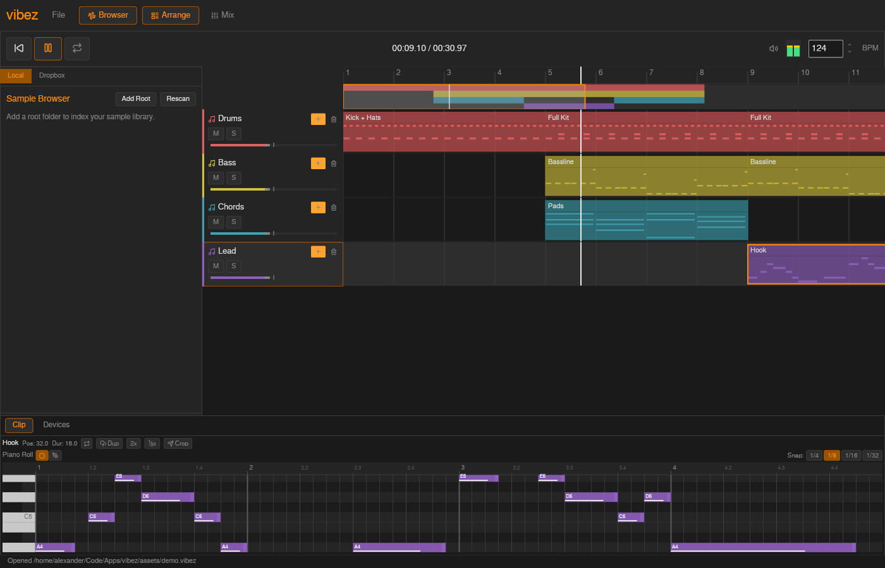

# vibez

An open-source digital audio workstation for electronic music, written in pure Rust.



vibez is built for producers and DJs who live in the arrangement view: warp loops
to your project tempo, sketch patterns in the piano roll, stack devices per track,
and host your VST3/CLAP plugins, all in a fast native app.

## Features

- **Multi-track arrangement** with audio and MIDI tracks, clip drag/resize/split/join,
  time selection, looping, and an overview minimap
- **Warping**: automatic BPM detection and high-quality time-stretching
  (Signalsmith Stretch), Ableton-style tempo follow: change the project BPM and
  warped clips stay in sync
- **Piano roll** with draw and select modes, multi-note editing, velocity,
  quantize, and adaptive snap grids
- **Built-in instruments**: subtractive synth, sampler, and a 16-pad drum rack
- **Built-in effects**: filter, delay, reverb, drive, bitcrush, compressor,
  auto-pan, gate, phaser, and gain
- **Plugin hosting**: VST3 and CLAP instruments and effects with native GUIs,
  sandboxed plugin scanning, and state persisted in your project
- **Sample browser** with local library indexing and Dropbox integration
- **Project save/load, undo/redo, and WAV export** from the master bus
- **MIDI input** for playing instruments live
- Real-time safe audio engine: lock-free and allocation-free in the audio callback

## Status

Early alpha, moving fast. Linux is the primary development platform; macOS and
Windows build and pass CI but get less testing. Expect rough edges and breaking
project-format changes before v0.1.

## Building

You need a Rust toolchain (stable) and, for the time-stretcher's C++ build,
a C++ compiler and libclang.

Linux additionally needs:

```sh
sudo apt install libasound2-dev libudev-dev libdbus-1-dev
```

Then:

```sh
cargo run --release
```

Open `assets/demo.vibez` (File, then Open) to hear and see something immediately.

## Architecture

vibez is a Cargo workspace:

| Crate | Purpose |
|-------|---------|
| `vibez-core` | Shared types: tracks, clips, MIDI, IDs |
| `vibez-engine` | Real-time audio engine (lock-free, allocation-free callback) |
| `vibez-audio-io` | Device I/O via cpal, realtime thread priority |
| `vibez-dsp` | Effects and time-stretching |
| `vibez-instruments` | Built-in synth, sampler, drum rack |
| `vibez-plugin-host` | VST3 and CLAP hosting, sandboxed scanning |
| `vibez-project` | Project file format (JSON) |
| `vibez-dropbox` | Dropbox sample browser backend |
| `vibez-ui` | The app: iced GUI, domain modules, message router |

The UI follows a strict domain architecture: each concern (transport, arrangement,
piano roll, devices, browser, project, view) owns its state slice and message enum,
talks to the engine through one injected interface, and is unit-tested without the
GUI. The UI thread and audio thread communicate over lock-free ring buffers only.
No source file exceeds 1,000 lines; that is a house rule.

## Contributing

Issues and pull requests are welcome. CI must stay green on Linux, macOS, and
Windows (`cargo test --workspace` and `cargo clippy --workspace -- -D warnings`).

## License

GPL-3.0-or-later. See [LICENSE](LICENSE).
