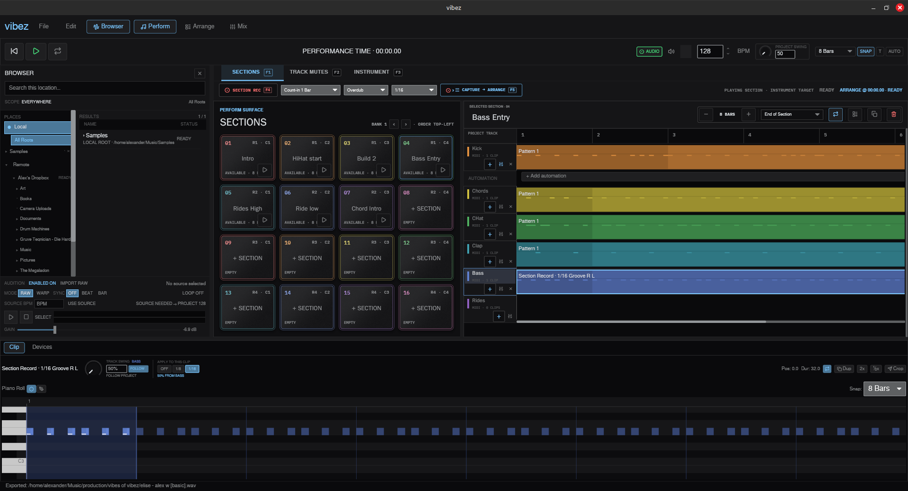
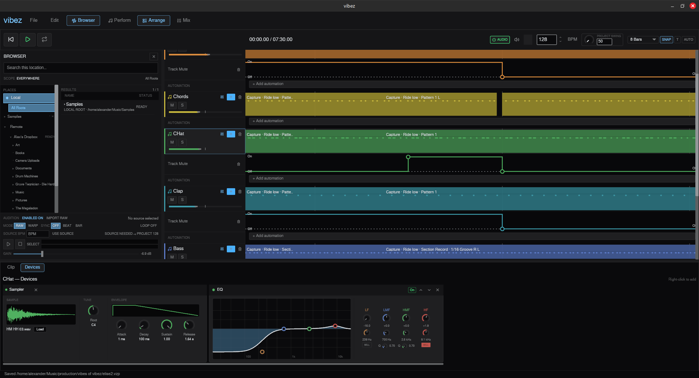
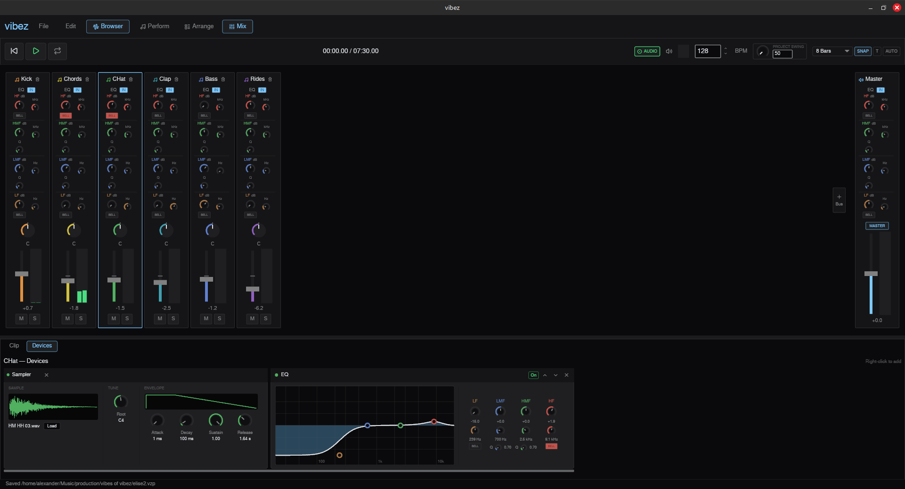

# vibez

A free and open source DAW for electronic music, written in Rust.

[Website](https://alexanderwanyoike.github.io/vibez/) · [Download the latest release](https://github.com/alexanderwanyoike/vibez/releases/latest)

vibez is built around **Perform**, **Arrange** and **Mix**. Jam out a tune in
Perform, polish the arrangement in Arrange, then focus on the mix. Capture
records a live performance into the arrangement so you can edit it afterwards.



## Perform

Perform is built around **Sections**: reusable multitrack loops that share your
project's tracks, instruments, effects and mixer. You author a Section with the
same editor you use in Arrange, then launch it from a pad grid.

- **Sections mode** launches Sections on a musical boundary (immediate, 1 beat,
  1 bar, or end of section), so a Section triggered slightly late still lands
  where you meant it
- **Instrument mode** turns the same 16 pads into a playable instrument for the
  selected track, with Full Level, 16 Levels, and Note Repeat
- **Track Mutes mode** mutes and unmutes tracks on that same grid, through an
  anti-click ramp so tails gate cleanly instead of clicking
- **Swing** modelled on the MPC2000XL, set per project, per track, or per clip
- **Section Record** with count-in, overdub and replace, timed against the audio
  engine's sample clock rather than the UI frame rate

The pad grid works from the computer keyboard, so you do not need a MIDI
controller to start. MIDI input can play notes into the selected instrument
track from one port at a time. Multiple ports and generic `.vdc` controller
mapping are still to come.

## Arrange

Arrange is the linear timeline, and it is where a performance lands. **Capture**
records an entire performance, Section launches, live playing, mutes and
automation gestures, and writes it here as ordinary clips and automation lanes
you can edit afterwards. Captured material keeps no reference back to its
Sections, so editing a Section later never rewrites a take you already
recorded.



Everything Capture writes is material you could have drawn by hand, so the rest
of Arrange applies to it unchanged:

- **Multi-track editing** for audio and MIDI, with clip
  drag/resize/split/join, time selection, looping, and an overview minimap
- **Audio recording** from a soundcard input or the output of an instrument
  track, with the waveform drawn while the take is recorded
- **Soundcard settings** for choosing the input device, output device, sample
  rate and buffer size
- **Warping** with automatic BPM detection and high-quality time stretching
  through Signalsmith Stretch. Warped clips follow the project BPM
- **Piano roll** with draw and select modes, multi-note editing, velocity,
  quantize, and adaptive snap grids
- **Automation** for track, device and plugin parameters, on tracks, buses,
  sends and master

## Mix

Mix is a real console rather than a row of faders. Every channel has its own
EQ, the master is an actual channel, and the device rack below follows the
selected one.



- **Channel strips** with a four-band EQ, pan, fader, metering, mute and solo
- **Buses, returns and sends**, and a real master channel rather than a
  summing shortcut
- **Built-in instruments**: subtractive synth, sampler, and a 16-pad drum rack
- **Built-in effects**: filter, delay, reverb, drive, bitcrush, compressor,
  auto-pan, gate, phaser, and gain
- **Plugin hosting**: VST3 and CLAP instruments and effects with native GUIs,
  sandboxed plugin scanning, and state persisted in your project

## Everything else

- **Sample browser** with local library indexing, Dropbox, RAW and WARP
  audition, automatic tempo sync, looping and a waveform playhead
- **Project save/load and autosave**, with undo, redo and WAV export from the
  master bus
- **Partial MIDI support**: one input port at a time, notes only, into the
  selected instrument track. More is planned for later versions
- Real-time safe audio engine: lock-free and allocation-free in the audio
  callback

## Status

v0.1.10, and still early. Linux is the primary development platform; macOS and
Windows build and pass CI on every change but get less hands-on testing.
Projects save to a self-contained versioned `.vzp` container, but breaking
format changes are still possible: treat this as a working alpha rather than a
stability promise.

## Building

You need a Rust toolchain (stable) and, for the time-stretcher's C++ build,
a C++ compiler and libclang.

Linux additionally needs:

```sh
sudo apt install libasound2-dev libudev-dev libdbus-1-dev
```

Then:

```sh
cargo run --release
```

Open `assets/demo.vibez` (File, then Open) to hear and see something immediately.

## Architecture

vibez is a Cargo workspace:

| Crate | Purpose |
|-------|---------|
| `vibez-core` | Shared types: tracks, clips, MIDI, IDs, Perform primitives |
| `vibez-engine` | Real-time audio engine (lock-free, allocation-free callback) |
| `vibez-audio-io` | Device I/O via cpal, realtime thread priority |
| `vibez-dsp` | Effects and time-stretching |
| `vibez-instruments` | Built-in synth, sampler, drum rack |
| `vibez-plugin-host` | VST3 and CLAP hosting, sandboxed scanning |
| `vibez-project` | Project file format: self-contained `.vzp`, legacy JSON |
| `vibez-dropbox` | Dropbox sample browser backend |
| `vibez-ui` | The app: iced GUI, domain modules, message router |

The UI is organized into domain modules (transport, arrangement, perform, piano
roll, devices, browser, project, view), each owning its own state and messages
and unit-tested without the GUI. The UI thread and audio thread communicate
over lock-free ring buffers, and the engine owns two clock domains so a live
performance and the Arrangement cursor stay independent.

For the full tour, threading model, message flow, and how Perform, plugins,
projects, and warping work, see [docs/ARCHITECTURE.md](docs/ARCHITECTURE.md).

## Contributing

Issues and pull requests are welcome. CI must stay green on Linux, macOS, and
Windows: `cargo test --workspace`, and Clippy with `-D warnings` over
`--all-targets`, so lints apply to test code too. `vibez-plugin-host` is
deliberately excluded from `--all-targets`; its tests drive the VST3 vtable ABI
where a redundant-looking cast can be load-bearing on another target.

## License

GPL-3.0-or-later. See [LICENSE](LICENSE).

## For Mum

This one's for you Mum 🥲 I miss you.

If you'd like to help my family give Mum a good send-off, you can
[donate to her GoFundMe](https://gofund.me/52cc80b1b).
