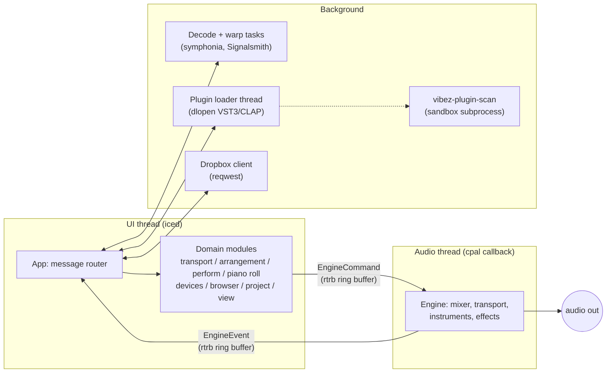
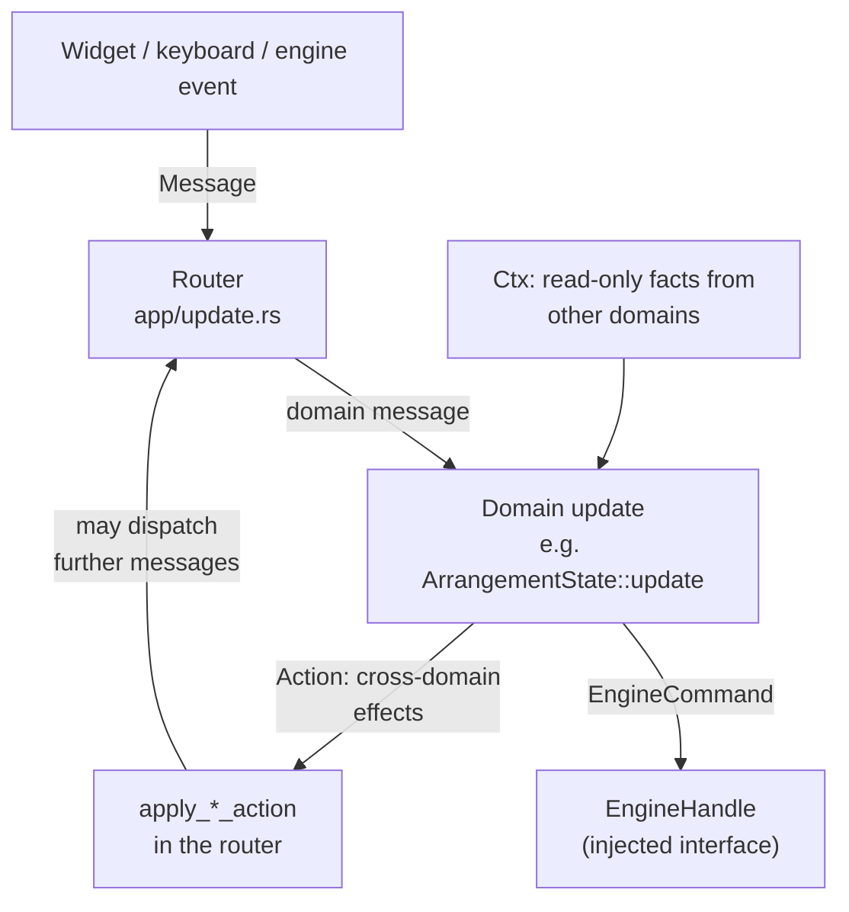
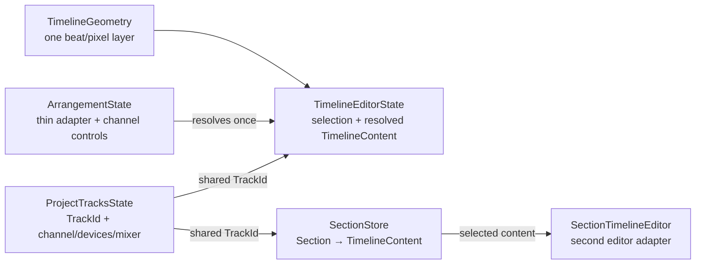
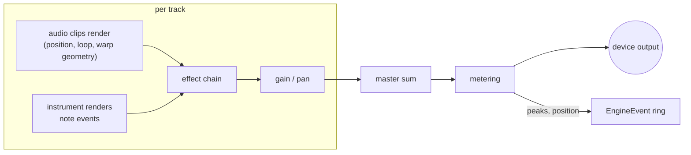
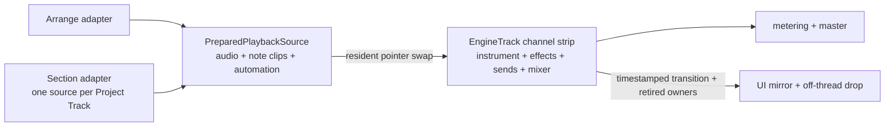

# vibez architecture

How vibez is put together and why. For build instructions and the feature
list, see the [README](../README.md).

## The big picture

vibez is two real-time worlds connected by lock-free queues. The UI thread
(iced) never blocks the audio thread, and the audio thread never allocates,
locks, or does I/O. Everything slow (file decode, plugin loading, network,
plugin scanning) happens on background threads or in subprocesses and reports
back through channels.

The UI polls the engine event ring at 60 fps (an iced subscription tick) and
pumps background services in the same tick: finished plugin loads, plugin GUI
run loops, and the legacy MIDI input. Computer-key Perform input instead enters
through iced's keyboard event subscription and is timestamped and dispatched
without waiting for that tick.

## Crate map

| Crate | Purpose |
|-------|---------|
| `vibez-core` | Shared types: tracks, clips, MIDI, IDs |
| `vibez-engine` | Real-time audio engine (lock-free, allocation-free callback) |
| `vibez-audio-io` | Device I/O via cpal, realtime thread priority |
| `vibez-dsp` | Effects and time-stretching |
| `vibez-instruments` | Built-in synth, sampler, drum rack |
| `vibez-plugin-host` | VST3 and CLAP hosting, sandboxed scanning |
| `vibez-project` | Project file format (JSON) |
| `vibez-dropbox` | Dropbox sample browser backend |
| `vibez-ui` | The app: iced GUI, domain modules, services |

## The UI: domains and one router

The UI follows the Elm architecture (iced's native model) with one twist:
instead of a single giant `update`, state and logic are split into **domain
modules** under `crates/vibez-ui/src/domains/`. Each domain owns:

- a **state slice** (for example `ArrangementState` holds Arrange Timeline
  Content and editor selection), stored on the app state
- a **message enum** (`ArrangementMsg`, `TransportMsg`, ...) describing
  everything that can happen to it
- an **update function** that can only touch its own slice, plus three narrow
  interfaces described below

The three interfaces that keep domains honest:

1. **`EngineHandle`** — the one way to talk to the audio engine. A trait, so
   tests inject a recorder and assert on the exact commands a message
   produced. Production wraps the real ring buffer.
2. **`Ctx` structs** — read-only facts a domain needs from outside (the
   playhead position, samples per beat). Computed by the router per message.
3. **`Action` structs** — effects a domain cannot perform itself (close a
   plugin window, set the status bar, mark the project dirty). Returned from
   `update`, executed by the router.

Because domains never touch iced, the GUI, or the real engine, they are unit
tested directly: construct a state, feed it messages, assert on the state,
the returned action, and the recorded engine commands.

Anything asynchronous (file dialogs, decoding, saving, bounce renders) stays
in the router layer as iced Tasks in topic modules under
`crates/vibez-ui/src/app/`; the results come back as messages and the state
math happens in the domains. Replaceable router work uses one `TrackedRequest`
lifecycle for monotonic tokens, stale-result rejection, cancellation, optional
iced task abortion, and abort-on-drop. Remote import, Remote materialization,
Browser import preparation, Remote catalog refresh, and Section residency keep
separate tracker instances but do not duplicate request IDs, generations, or
abort handles.

Application menus and the Arrange context menu also use explicit router
events. Their overlay backdrops emit dismissal, Escape targets the topmost
visible menu, and a menu-item event dispatches its command before closing its
origin overlay. Ordinary application messages never participate in menu
lifecycle, so engine ticks, metering, catalog work, and future message variants
cannot dismiss a menu accidentally. Buttons remain native iced controls for
focus and keyboard activation; device and plug-in menus retain their separate
domain-owned lifecycles.

Perform follows the same boundary. `PerformState` owns runtime-only mode, bank,
selection, and editor-focus state alongside an `Arc<SectionStore>` that enters
project persistence and undo. Each Section owns its properties and an
independent `ArrangementTimeline` keyed by the same shared Project `TrackId`s;
duplicating a Section remints every editable content identity while immutable
decoded audio remains shared. `PerformMsg` changes that slice through the
router and `EngineHandle`. A Section launch returns a semantic action; the
router prepares the complete playback source on a cancellable background task,
then sends only the resident owner and launch policy to the engine. A newer
launch cancels and invalidates stale residency work without coupling the
Perform interaction slice to engine storage. Perform is a sibling of Arrange
and Mix in the shared shell, and all three retain their
interaction state when producers switch between them. Track Mute pad slots
retain stable `TrackId` assignments across
track additions and deletions. A pad press resolves inside Perform to a narrow
mute request; the router applies that request to the one project-owned mute
field used by Arrange and Mix instead of storing a second Perform value.

Perform input adapters resolve physical controls before mode semantics. The
computer-key adapter maps physical key codes through the global
`PerformInputMapping`, suppresses auto-repeat, pairs releases with the original
press, and emits a timestamped `PadGesture` containing Pad Position, state,
optional velocity, and source identity. The domain consumes the gesture
synchronously to mirror pressed state in the Pad Surface. Instrument mode also
resolves the project-wide selected Track through the playable MIDI Project
Track filter and sends paired live note commands through `EngineHandle`,
without deriving input from rendered state or the 60 fps engine-event pump.
Each held key remembers its original Track and pitch so target changes, mode
changes, and Section transitions cannot redirect its note-off. The Shift target
overlay and on-screen selector update the same selection used by the Section
overview, while per-mode target banks remain runtime interaction state.
Window focus loss drains all held computer keys through matching note-offs and
clears the Shift overlay so OS-level focus changes cannot leave a note sounding.
Widget-captured presses are not forwarded, so text fields suppress pad input.
The mapping and fixed computer-key velocity (default 100) persist in the user's
`ui.json` settings and are absent from the project document and undo snapshots.

Instrument Pad Gestures resolve through one live note-transform boundary before
they become paired engine note commands. Full Level supplies the effective
velocity there for every input adapter. A 16 Levels Assignment combines one
remembered source pitch, one generic sixteen-step range, and a data descriptor
whose apply function owns either pitch or velocity; adding a future parameter
does not add branches to Pad Surface semantics. The held-note record retains the
resolved Track and pitch, so changing a range, assignment, or Instrument Target
cannot redirect its eventual note-off. These controls and their source memory
are runtime performance state rather than project content.

Instrument Note Repeat crosses the same input boundary without introducing a
UI clock. Holding `N` or a future mapped control, or enabling the on-screen
latch, starts fixed-capacity repeat voices in the audio engine after the source
note has sounded. The engine schedules straight and triplet subdivisions on its
sample clock, accepts rate changes without an immediate retrigger, and emits
`NoteRepeated` events with both the audible sample timestamp and its canonical
straight-clock timestamp. Pad release owns the matching stop and note-off even
when the latch remains enabled.

Section Record keeps its destination fixed when it is armed: the engine-owned
playing Section and the then-current Instrument Target. From stopped transport,
the router prepares the selected Section off the audio thread and transfers the
resident owner with an Off/one-bar/two-bar count-in. During playback the engine
arms at the next local Section bar without restarting it. `SectionRecordArmed`,
`SectionRecordStarted`, monitored note, repeated-note, and stop events all carry
engine sample timestamps; the 60 fps UI tick never supplies recorded timing.
The UI collects one runtime session, applies Overdub or the first crossed
Replace span on stop, and writes full-Section MIDI clips grouped by Groove Grid.
Free notes bake their selected input quantization while preserving performed
duration and keep Groove Grid Off. `1/8` and `1/16` Note Repeat stores the
canonical straight position with its matching Groove Grid, so playback applies
live Swing once and later Swing edits remain effective.

Capture into Arrange is a separate runtime log over the Perform clock. The
engine owns two explicit clock domains: the canonical Arrange cursor advances
only while Arrange renders, while a zero-based monotonic Perform clock advances
during Section playback and stopped-start count-in. Section queue, Record,
Note Repeat, monitored input, Track Mute, and Capture events use the latter.
`PlaybackPosition` therefore always means Arrange cursor;
`PerformancePosition` is the independent value shown as Performance time.
`PerformanceCaptureStarted`, `SectionTransitioned`, and
`PerformanceCaptureStopped` report exact effective samples, including a
transition that splits an audio callback and a Capture begun partway through an
already-playing Section. The UI snapshots each canonical Section timeline at
the boundary where it becomes audible. On stop, it flattens those snapshots
across Section loop passes into newly identified Arrange audio and MIDI clips,
offset from the fixed Arrange cursor captured at session start. Elapsed Perform
time is mapped onto that destination, so rehearsal and Section loops cannot
move it. The copied clips
share only immutable decoded audio; they retain no Section identity or mutable
reference, so later Section edits and launches cannot rewrite Arrange.

Capture treats every Project Track controlled by Perform as punch-replace,
including tracks that produced silence. At the confirmed stop boundary it
removes the recorded interval, preserves and splits material on either side,
and pins existing automation values at both edges before inserting captured
content. The still-open transaction therefore covers the whole replacement as
one undo step. Track Mute events join the Capture log at their engine-effective
samples and materialize as `track_mute` step points with a closing point that
restores the pre-take manual state.

The project document persists the immutable `mpc_2000xl_v1` Groove Profile,
Project Swing, and optional Project Track Swing offsets as canonical project
data and undo state. Swing uses the profile's native `50..75%` long/short pair
ratio and the Project Track offset adds percentage points before clamping to
that range. Generated `1/8` and `1/16` events resolve on the profile's 96 PPQN
clock; `1/4`, `1/32`, and triplet rates remain exact. MIDI clips opt into the
same live transform with a persisted `Off | 1/8 | 1/16` Groove Grid; `Off` is
the legacy and new-clip default. The render scheduler maps both endpoints
through a monotonic pair shape whose midpoint is the same 96 PPQN Swing tick,
so stored beat positions remain canonical and free human timing needs no
tolerance heuristic. Swing is latched at each clip-local pair boundary, applied
at the shared Arrange/Section event read, and never baked into prepared Section
content. Shortened sources drop mapped onsets beyond their boundary, and mapped
note-offs are clamped to the next same-pitch onset.
While transport plays, the first repeated hit comes from the active musical
grid and an Immediate Section transition establishes a new grid origin. Vibez
deliberately extends MPC Note Repeat to stopped transport: the first pad sounds
immediately as step zero, later pads share that anchor, and the anchor clears
when the final repeated pad stops. Tempo and rate changes reschedule future hits
without changing the anchor. Swing and Project Track offset edits preserve the
scheduled in-flight pair and become audible when the next pair begins.

Swing UI uses two views of that same model rather than introducing a third
value: Project Swing edits the native `50..75%` ratio, while contextual Target
Swing shows the selected MIDI Project Track's effective ratio and its optional
Project-relative offset. `FOLLOW` removes the manual offset. A persisted
`track_swing_offset` automation lane stores that relative offset normalized
from `-25..+25` percentage points; while a lane has a value it takes precedence
over the manual offset and the Target control is read-only and marked `AUTO`.
Automation is evaluated at the existing render-block boundary, then the Groove
scheduler latches the effective result for each musical pair. Consequently a
change cannot retime an in-flight pair, and both Note Repeat and opted-in clips
adopt it at their next pair boundary.

Track Swing is not owned by the Perform workspace. The Instrument rail edits
the current Instrument Target, while the shared Arrange/Section Clip inspector
edits the selected MIDI clip's parent Project Track through the same explicit
Track identity. The inspector presents the relationship as one unit: Track
Swing supplies the effective amount, and `OFF | 1/8 | 1/16` decides whether and
on which grid that individual clip follows it. With no MIDI clip selected, the
Track control remains available but clip application is withheld.

Track mute commands become authoritative when the audio callback drains them.
The engine emits `EngineEvent::TrackMuteChanged` with the effective state and
absolute transport sample; the UI mirrors that result into the shared Project
Track and an active Capture log. `track_mute` automation is stepped: it imposes
nothing before its first point and changes state at exact in-buffer sample
boundaries. Both manual and automated mute feed one post-effects, pre-send
anti-click ramp, so playback gates tails exactly like the performed mute.

Automation overrides live beside evaluation in the shared `EngineTrack`
channel strip. A manual mixer or Perform-pad mute on a track with a mute lane
sets the Track Mute override; the manual value remains authoritative until the
producer uses the visible `RE-ENABLE` affordance. The command/event protocol is
parameter-shaped rather than mute-specific so gain and pan can adopt the same
ownership later without introducing a second override model. Override state is
runtime UI/engine state and is not persisted.

## Project Tracks and timeline content

Project Tracks exist once per project. `ProjectTracksState` owns their stable
`TrackId`, channel name/type, instruments, effects, routing, sends, and mixer
state. Arrange does not own or duplicate those channels.

`TimelineContent` is the separate musical-content store keyed by shared
`TrackId`. Each `TrackTimelineContent` contains only the audio clips, note
clips, and automation associated with that Project Track in one timeline.
Track order is therefore independent from timeline storage, and a timeline
edit cannot clone instruments, effects, routing, or mixer state. Arrange owns
one `TimelineContent`, while every Perform Section owns another store with the
same shape and shared Project `TrackId`s.

`TimelineEditorState` is the shared editing boundary around that content. It
owns clip/note selection, time selection, and other timeline-local interaction
state; clip operations, piano-roll editing, automation editing, and timeline
view behavior receive this already-resolved target. `AppState` owns one runtime
Clip clipboard shared by Arrange and every Section editor. The application
resolves clipboard shortcuts from the focused editor and supplies that
clipboard at the editor boundary. `ArrangementState` is a thin adapter that
retains Arrange's Project Track/channel controls and implements
`TimelineEditorAdapter` to resolve its editor. The editor never asks which
workspace is active and contains no `Arrange | Section` branch.

The selected Perform Section provides the editor adapter through a
runtime-only `SectionTimelineEditor`. Selecting a Section resolves its
persisted Timeline Content into the adapter while preserving the project-wide
Project Track selection; clip and piano-roll selection remain local to the
resolved Section editor. Every edit commits the adapter's copy-on-write
Timeline Content back into the selected Section store for undo and project
persistence. Section authoring still uses a discarding engine handle so edits
to a selected, non-playing Section cannot mutate either resident audio source;
a launch prepares a fresh resident adapter from canonical Section content.

Every horizontal editor surface uses `TimelineGeometry` for beat-to-pixel,
pixel-to-beat, fitted viewport, visible-range, and beat-width conversions.
Ruler, clip lanes, automation, piano roll, minimap, drag/drop, and auto-scroll
therefore share one geometry implementation even when they use different
resolved scales. A generic conformance harness currently runs against the
Arrange adapter and is reusable unchanged by the Section adapter.

Undo snapshots retain the Project Track store, Arrange Timeline Content, and
Section store as separate `Arc` values. Copy-on-write happens only in the store
being edited. Meters, decoded device media, waveform/runtime caches, and UI
selection are UI runtime state; they are not fields of persisted timeline
content.

`UndoHistory` also owns the single open `ProjectTransaction`. Beginning a
transaction retains those same `Arc`-shared canonical stores, edits continue
through their existing domain boundaries, and commit adds the pre-edit state as
exactly one undo step. Abandon returns that state for rollback without changing
history. Transactions do not nest: a multi-store operation encountered inside
an existing recording transaction participates in the outer transaction.
Project Track deletion removes the shared identity from Project Tracks,
Arrange, and every Section before committing one step. Section Record is the
long-lived consumer: it opens before residency/arming and commits the complete
Overdub or Replace session on the engine-confirmed stop as one undo step.
Editor selections, meters, decoded/runtime caches, and live plugin pointers are
outside the transaction snapshot and are neither cloned nor restored.
Capture opens the same transaction before requesting its engine start boundary,
then marks one edit and commits only after the engine-confirmed stop has
materialized independent Arrange content and replaced the controlled interval.
A session that has neither captured content nor anything to replace abandons
the transaction, while undo/redo replays the complete captured Arrangement as
one project step.

## The audio engine

The engine lives on the cpal audio callback. Its rules:

- **No allocation, no locks, no I/O** in the callback, ever.
- All mutations arrive as `EngineCommand` values through the ring buffer and
  are drained at the start of each callback.
- Everything the engine needs (decoded audio, plugin instances, note data) is
  handed to it fully constructed; `Arc<DecodedAudio>` shares immutable sample
  data with the UI without copying.
- Resources that must be destroyed RT-safely (plugin instances) are handed
  *back* to the UI thread as `EngineEvent::Dispose*` events rather than
  dropped in the callback.

Signal flow per callback:

`EngineTrack` is the shared project channel strip: it owns the instrument,
effects, sends, gain/pan, mute/solo, meters, and preallocated render scratch.
Time-based content is a separate `PreparedPlaybackSource` behind an owned
pointer. `ArrangementPlaybackSource` and the active Section adapter feed the
same channel renderer, so there is no second clip, note, automation,
instrument, effect, or send implementation. A complete
`PreparedSectionPlaybackSource` contains one resident source for every Project
Track, including empty sources that mean intentional silence. It holds decoded
clip `Arc`s and exposes no loader or I/O API.

`EngineCommand::LaunchSection` retains the immediate Card 10 path.
`EngineCommand::QueueSection` transfers a prepared owner plus its Immediate,
beat, bar, or end-of-Section policy. The engine computes and owns the pending
absolute Perform-sample boundary, returns displaced queued owners to the UI
thread, and
splits rendering when that boundary falls partway through a callback. Only then
does it swap the resident pointers, reset the local Section playhead, and emit a
sample-timestamped `SectionTransitioned` event. `SectionQueued` is likewise the
only source of queued-pad and pending-boundary UI state. The callback never
loads, locks, performs I/O, or drops a resident source. Section loop wraps split
inside a callback at the playable boundary, flush sounding notes, and continue
from local sample zero. Empty sources still run the shared device chain,
allowing existing effect tails to decay naturally. Live Project Track mutes
remain channel state across transitions, and the engine plus Transport domain
hold one Project BPM until Perform playback stops.

`EngineCommand::ArmSectionRecord` adds a separate engine-clock state machine.
An already-playing Section computes the next bar from its local playhead. A
stopped-start count-in advances the monotonic Perform clock without touching
the Arrange cursor and, if its boundary falls inside a callback, renders the
prefix before activating the resident Section at local sample zero for the
suffix. Recording does not route notes through a
second renderer: monitored input stays on the existing instrument path while
`InstrumentNoteInput` and enriched `NoteRepeated` events report the exact
effective/local positions. `StopSectionRecord` returns a cancelled resident
owner to the UI or closes the active session without allocating or dropping it
in the callback. Section launches and BPM changes are held while this fixed
recording target is armed.

## Plugins (VST3 and CLAP)

Third-party plugins are the least trustworthy code in the process, so they
are handled in three stages:

1. **Scanning** runs in a separate `vibez-plugin-scan` subprocess. A plugin
   that crashes during a scan kills the subprocess, not vibez. VST3 scanning
   reads `IPluginFactory2::getClassInfo2` subcategories so `Instrument`
   components enter the Track instrument slot while `Fx` components remain
   inserts.
2. **Loading** is two-phase: a background thread does the `dlopen` and
   factory lookup, then the UI thread finishes initialization. The UI-thread
   phase is mandatory because JUCE-based plugins bind their message loop to
   the initializing thread.
3. **Running**: the audio thread processes the plugin like any built-in
   effect; the UI thread pumps plugin GUI run loops on the 60 fps tick and
   captures plugin state for saving. VST3 instruments receive the engine's
   timed note queue through a callback-lifetime `IEventList`; events are sorted
   by sample offset and preserve within-block note-on/note-off timing before
   `IAudioProcessor::process` runs.

## Projects, undo, and warping

- Projects are JSON (`vibez-project`): Project Tracks remain in the existing
  `tracks`/`master`/`buses` fields. The canonical document contains Arrange
  Timeline Content plus an ordered Section store, with each Section carrying
  its properties and Timeline Content. Arrange audio and note clips stay
  flattened into the existing `clips`/`note_clips` keys for compatibility;
  legacy track automation is migrated into Arrange Timeline Content on load.
  Project Groove data persists as the versioned `groove_profile`, native
  `swing` ratio, optional Project Track `swing_offset` fields, and each MIDI
  clip's opt-in `groove_grid`.
  Existing project bytes therefore load with an empty Section store and no
  format migration.
- Save, load, media collection and hydration, unresolved-media preservation,
  ID discovery, and runtime projection consume the document's single timeline
  traversal. A media source referenced by Arrange and Sections is embedded once
  in the `.vzp` container. Only Arrange content is replayed to the engine until
  Section launch/playback is implemented.
- Undo/redo keeps independently shared snapshots of Project Tracks, Arrange
  Timeline Content, and Sections (audio is also shared via `Arc`). Restoring a
  snapshot tears down the engine side and replays the currently playable
  Arrange store.
  Live plugin state is captured before teardown so undo does not reset
  plugin parameters.
- Long-lived recording edits use one explicit Project Transaction from start
  through stop. Commit creates one undo step regardless of the number of
  canonical stores edited; abandonment rolls every canonical edit back and
  creates no history entry.
- Warping detects a clip's BPM, then time-stretches it to the project tempo
  with Signalsmith Stretch (near-unity ratios use a resampler instead).
  Changing the project tempo re-warps every warped clip so the arrangement
  stays in sync.
