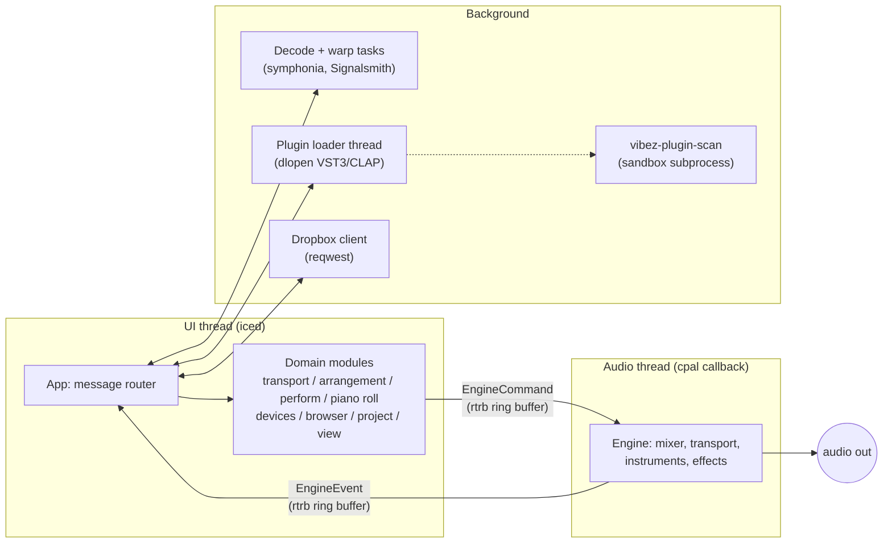
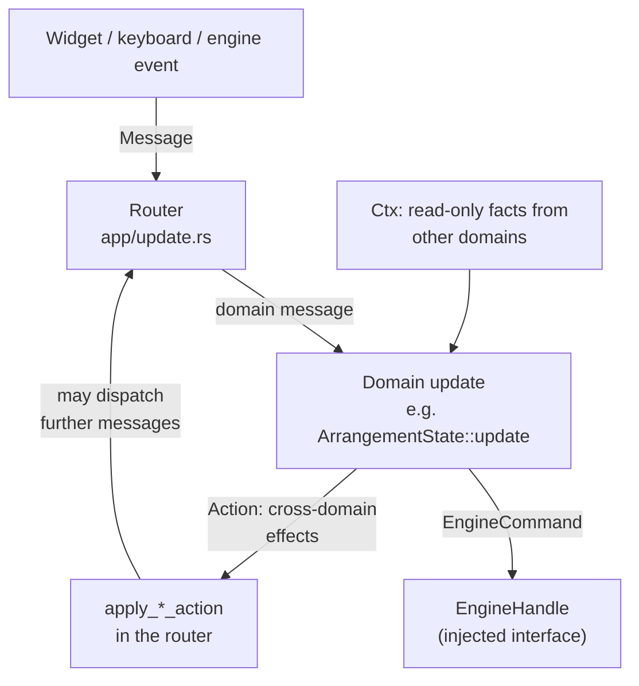
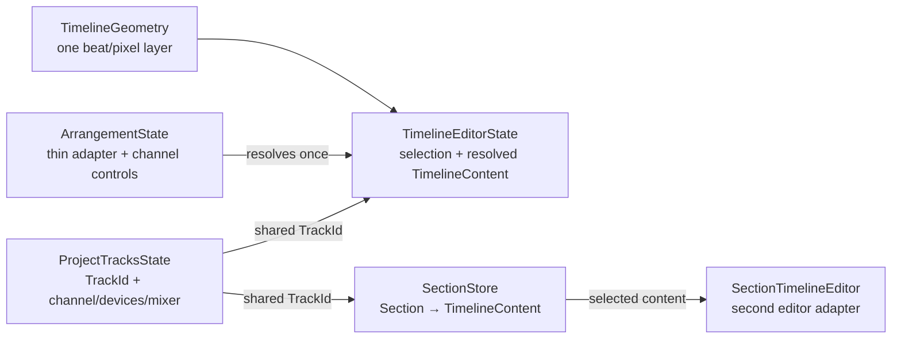
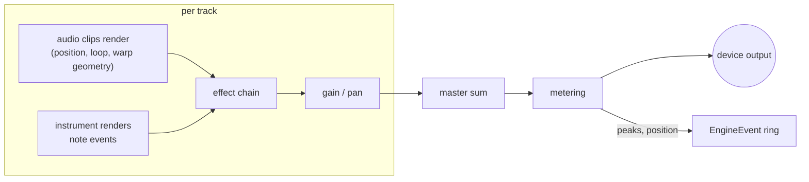
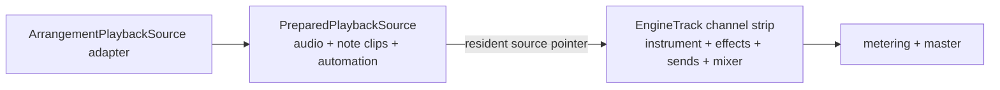

# vibez architecture

How vibez is put together and why. For build instructions and the feature
list, see the [README](../README.md).

## The big picture

vibez is two real-time worlds connected by lock-free queues. The UI thread
(iced) never blocks the audio thread, and the audio thread never allocates,
locks, or does I/O. Everything slow (file decode, plugin loading, network,
plugin scanning) happens on background threads or in subprocesses and reports
back through channels.

The UI polls the engine event ring at 60 fps (an iced subscription tick) and
pumps background services in the same tick: finished plugin loads, plugin GUI
run loops, and the legacy MIDI input. Computer-key Perform input instead enters
through iced's keyboard event subscription and is timestamped and dispatched
without waiting for that tick.

## Crate map

| Crate | Purpose |
|-------|---------|
| `vibez-core` | Shared types: tracks, clips, MIDI, IDs |
| `vibez-engine` | Real-time audio engine (lock-free, allocation-free callback) |
| `vibez-audio-io` | Device I/O via cpal, realtime thread priority |
| `vibez-dsp` | Effects and time-stretching |
| `vibez-instruments` | Built-in synth, sampler, drum rack |
| `vibez-plugin-host` | VST3 and CLAP hosting, sandboxed scanning |
| `vibez-project` | Project file format (JSON) |
| `vibez-dropbox` | Dropbox sample browser backend |
| `vibez-ui` | The app: iced GUI, domain modules, services |

## The UI: domains and one router

The UI follows the Elm architecture (iced's native model) with one twist:
instead of a single giant `update`, state and logic are split into **domain
modules** under `crates/vibez-ui/src/domains/`. Each domain owns:

- a **state slice** (for example `ArrangementState` holds Arrange Timeline
  Content and editor selection), stored on the app state
- a **message enum** (`ArrangementMsg`, `TransportMsg`, ...) describing
  everything that can happen to it
- an **update function** that can only touch its own slice, plus three narrow
  interfaces described below

The three interfaces that keep domains honest:

1. **`EngineHandle`** — the one way to talk to the audio engine. A trait, so
   tests inject a recorder and assert on the exact commands a message
   produced. Production wraps the real ring buffer.
2. **`Ctx` structs** — read-only facts a domain needs from outside (the
   playhead position, samples per beat). Computed by the router per message.
3. **`Action` structs** — effects a domain cannot perform itself (close a
   plugin window, set the status bar, mark the project dirty). Returned from
   `update`, executed by the router.

Because domains never touch iced, the GUI, or the real engine, they are unit
tested directly: construct a state, feed it messages, assert on the state,
the returned action, and the recorded engine commands.

Anything asynchronous (file dialogs, decoding, saving, bounce renders) stays
in the router layer as iced Tasks in topic modules under
`crates/vibez-ui/src/app/`; the results come back as messages and the state
math happens in the domains. Replaceable router work uses one `TrackedRequest`
lifecycle for monotonic tokens, stale-result rejection, cancellation, optional
iced task abortion, and abort-on-drop. Remote import, Remote materialization,
Browser import preparation, and Remote catalog refresh keep separate tracker
instances but do not duplicate request IDs, generations, or abort handles.

Perform follows the same boundary. `PerformState` owns runtime-only mode, bank,
selection, and editor-focus state alongside an `Arc<SectionStore>` that enters
project persistence and undo. Each Section owns its properties and an
independent `ArrangementTimeline` keyed by the same shared Project `TrackId`s;
duplicating a Section remints every editable content identity while immutable
decoded audio remains shared. `PerformMsg` changes that slice through the
router and `EngineHandle`. Creating and editing Sections does not send engine
commands yet—Section playback belongs to the later launch slice. Perform is a
sibling of Arrange and Mix in the shared shell, and all three retain their
interaction state when producers switch between them. Track Mute pad slots
retain stable `TrackId` assignments across
track additions and deletions. A pad press resolves inside Perform to a narrow
mute request; the router applies that request to the one project-owned mute
field used by Arrange and Mix instead of storing a second Perform value.

Perform input adapters resolve physical controls before mode semantics. The
computer-key adapter maps physical key codes through the global
`PerformInputMapping`, suppresses auto-repeat, pairs releases with the original
press, and emits a timestamped `PadGesture` containing Pad Position, state,
optional velocity, and source identity. The domain consumes the gesture
synchronously to mirror pressed state in the Pad Surface; later musical slices
consume the same gesture action without deriving input from rendered state or
the 60 fps engine-event pump. Widget-captured presses are not forwarded, so
text fields suppress pad input. The mapping persists in the user's `ui.json`
settings and is absent from the project document and undo snapshots.

Track mute commands become authoritative when the audio callback drains them.
The engine emits `EngineEvent::TrackMuteChanged` with the effective state and
absolute transport sample; the UI mirrors that result into the shared Project
Track. This keeps pad, mixer, persisted, and audible state aligned while giving
later Capture work an engine-timestamped event source.

## Project Tracks and timeline content

Project Tracks exist once per project. `ProjectTracksState` owns their stable
`TrackId`, channel name/type, instruments, effects, routing, sends, and mixer
state. Arrange does not own or duplicate those channels.

`TimelineContent` is the separate musical-content store keyed by shared
`TrackId`. Each `TrackTimelineContent` contains only the audio clips, note
clips, and automation associated with that Project Track in one timeline.
Track order is therefore independent from timeline storage, and a timeline
edit cannot clone instruments, effects, routing, or mixer state. Arrange owns
one `TimelineContent`, while every Perform Section owns another store with the
same shape and shared Project `TrackId`s.

`TimelineEditorState` is the shared editing boundary around that content. It
owns clip/note selection, the clipboard, time selection, and other interaction
state; clip operations, piano-roll editing, automation editing, and timeline
view behavior receive this already-resolved target. `ArrangementState` is a
thin adapter that retains Arrange's Project Track/channel controls and
implements `TimelineEditorAdapter` to resolve its editor. The editor never
asks which workspace is active and contains no `Arrange | Section` branch.

The selected Perform Section now provides that second adapter through a
runtime-only `SectionTimelineEditor`. Selecting a Section resolves its
persisted Timeline Content into the adapter while preserving the project-wide
Project Track selection; clip and piano-roll selection remain local to the
resolved Section editor. Every edit commits the adapter's copy-on-write
Timeline Content back into the selected Section store for undo and project
persistence. Until the Section playback source lands, a discarding engine
handle prevents shared editor synchronization commands from mutating the
audible Arrange source.

Every horizontal editor surface uses `TimelineGeometry` for beat-to-pixel,
pixel-to-beat, fitted viewport, visible-range, and beat-width conversions.
Ruler, clip lanes, automation, piano roll, minimap, drag/drop, and auto-scroll
therefore share one geometry implementation even when they use different
resolved scales. A generic conformance harness currently runs against the
Arrange adapter and is reusable unchanged by the Section adapter.

Undo snapshots retain the Project Track store, Arrange Timeline Content, and
Section store as separate `Arc` values. Copy-on-write happens only in the store
being edited. Meters, decoded device media, waveform/runtime caches, and UI
selection are UI runtime state; they are not fields of persisted timeline
content.

## The audio engine

The engine lives on the cpal audio callback. Its rules:

- **No allocation, no locks, no I/O** in the callback, ever.
- All mutations arrive as `EngineCommand` values through the ring buffer and
  are drained at the start of each callback.
- Everything the engine needs (decoded audio, plugin instances, note data) is
  handed to it fully constructed; `Arc<DecodedAudio>` shares immutable sample
  data with the UI without copying.
- Resources that must be destroyed RT-safely (plugin instances) are handed
  *back* to the UI thread as `EngineEvent::Dispose*` events rather than
  dropped in the callback.

Signal flow per callback:

`EngineTrack` is the shared project channel strip: it owns the instrument,
effects, sends, gain/pan, mute/solo, meters, and preallocated render scratch.
Time-based Arrange content is now a separate `PreparedPlaybackSource` behind
one owned pointer. `ArrangementPlaybackSource` is the first adapter and the
same source renderer feeds the existing channel path, so there is no second
clip, note, automation, instrument, or effect implementation. Prepared sources
contain decoded clip `Arc`s and expose no loader or I/O API. Card 10 supplies
the Section adapter and the first pointer transfer; the callback must exchange
prepared ownership only and return superseded ownership for disposal outside
the real-time thread rather than dropping it there.

## Plugins (VST3 and CLAP)

Third-party plugins are the least trustworthy code in the process, so they
are handled in three stages:

1. **Scanning** runs in a separate `vibez-plugin-scan` subprocess. A plugin
   that crashes during a scan kills the subprocess, not vibez.
2. **Loading** is two-phase: a background thread does the `dlopen` and
   factory lookup, then the UI thread finishes initialization. The UI-thread
   phase is mandatory because JUCE-based plugins bind their message loop to
   the initializing thread.
3. **Running**: the audio thread processes the plugin like any built-in
   effect; the UI thread pumps plugin GUI run loops on the 60 fps tick and
   captures plugin state for saving.

## Projects, undo, and warping

- Projects are JSON (`vibez-project`): Project Tracks remain in the existing
  `tracks`/`master`/`buses` fields. The canonical document contains Arrange
  Timeline Content plus an ordered Section store, with each Section carrying
  its properties and Timeline Content. Arrange audio and note clips stay
  flattened into the existing `clips`/`note_clips` keys for compatibility;
  legacy track automation is migrated into Arrange Timeline Content on load.
  Existing project bytes therefore load with an empty Section store and no
  format migration.
- Save, load, media collection and hydration, unresolved-media preservation,
  ID discovery, and runtime projection consume the document's single timeline
  traversal. A media source referenced by Arrange and Sections is embedded once
  in the `.vzp` container. Only Arrange content is replayed to the engine until
  Section launch/playback is implemented.
- Undo/redo keeps independently shared snapshots of Project Tracks, Arrange
  Timeline Content, and Sections (audio is also shared via `Arc`). Restoring a
  snapshot tears down the engine side and replays the currently playable
  Arrange store.
  Live plugin state is captured before teardown so undo does not reset
  plugin parameters.
- Warping detects a clip's BPM, then time-stretches it to the project tempo
  with Signalsmith Stretch (near-unity ratios use a resampler instead).
  Changing the project tempo re-warps every warped clip so the arrangement
  stays in sync.
